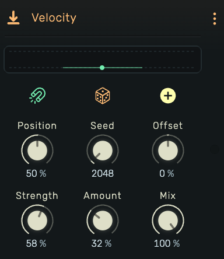

# Velocity (MIDI Effect)

A MIDI effect for shaping **note velocity**. Use it to push crescendos and swells, control dynamics, or add humanized variation without having to manage per note velocity.

---

---

## 0. Overview

_Velocity_ works like a “magnet” that pulls incoming note velocities toward a **Target Velocity**. You decide how strongly the magnet pulls, whether to **offset** the result up/down, and how much **human variation** to add. A final **Mix** blends the processed (wet) velocities with the original (dry) values.

Example uses:

- Global crescendos/decrescendos via automation  
- Clamping velocities to a consistent dynamic level  
- Subtle humanization for programmed parts  
- Making layered instruments respond more evenly

# 1. Velocity (MIDI Effect) – Controls

Below are the **authoritative control descriptions**, merged from the latest UI tour and parameters.

## 1.1 Velocity Window
Visualizes how programmed note velocity (from the piano roll) is transformed by this effect. The window spans MIDI **0–127** from left (soft) to right (hard). The **magnet** appears as a dot indicating the current target velocity.

## 1.2 Magnetization (Magnet Icon)
Controls that attract velocities toward a target value.

### 1.2.1 Position (Target Velocity)
Sets the target location for the magnet. Adjustable **0–100%** left→right, mapped to MIDI **0–127**.

### 1.2.2 Strength
- Determines the pull toward **Position**, represented by the line intersecting the magnet dot in the velocity window.
- **0%** = no change to programmed velocities.  
- **100%** = velocities are overridden to the magnet’s position.  
- Intermediate values pull proportionally toward the target.

## 1.3 Humanization (Dice Icon)
Controls that introduce randomized, human-like variation.

### 1.3.1 Amount
Depth of randomization **0–100%** (higher = more per‑note variation around the processed value).

### 1.3.2 Seed
Random generator seed.

## 1.4 Offset (Plus Icon)
Applies a fixed velocity shift **after** magnetization and before clamping.

### 1.4.1 Offset
Adds or subtracts from programmed/processed velocity in the range **±100%**. Final values are clamped to valid MIDI limits.

## 1.5 Mix
Blends original and processed velocities.  
**0%** = dry passthrough. **100%** = fully processed.

# 2. Technical Notes & Limits

## 2.1 Processing Order
The effect applies changes in this order:
1. **Target Pull** — Notes are pulled toward the **Position** by **Strength**.
2. **Humanization** — Random variation is added (set by **Amount**, shaped by **Seed**).
3. **Offset** — The whole result is nudged up or down by **Offset**.
4. **Safety Clamp** — The processed value is kept within a valid velocity range.
5. **Mix** — The processed result is blended with the original using **Mix**.

## 2.2 Units
- Processed velocities are clamped **internally as float**
- UI controls: shown as **0-100%**
- MIDI output: Emitted as 0-127

**Example mapping**
- 50% (UI) ↔ 0.50 ↔ ~64 (MIDI)
- 75% (UI) ↔ 0.75 ↔ ~95 (MIDI)

## 2.3 Other Details
- Only **Note On** velocities are modified; other MIDI messages (aftertouch, CCs, etc.) pass through unchanged.    
- With **Strength = 100%** and **Mix = 100%**:  
  - If **Amount = 0** → **Position + Offset** → clamp.  
  - If **Amount > 0** → **Position + Offset + Humanization** → clamp.

